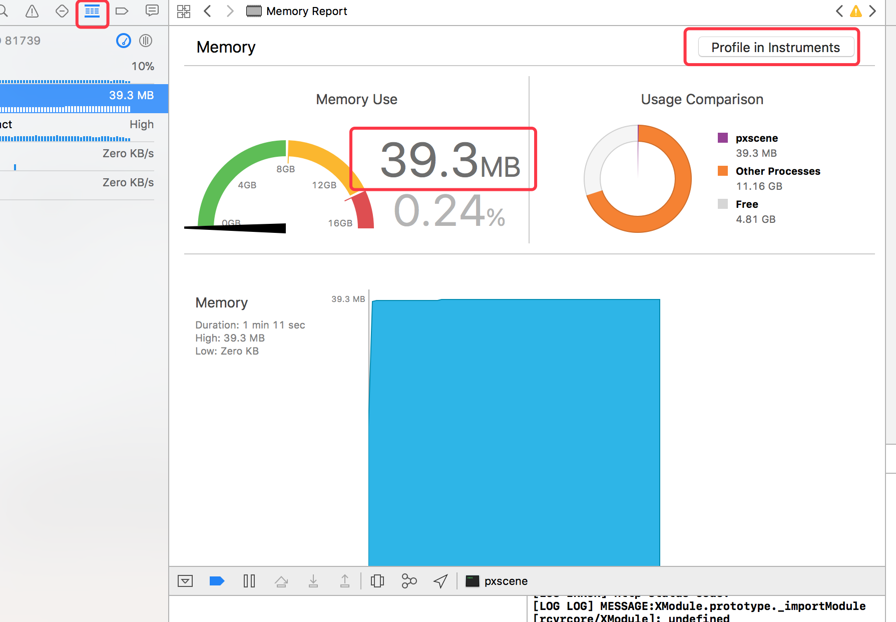
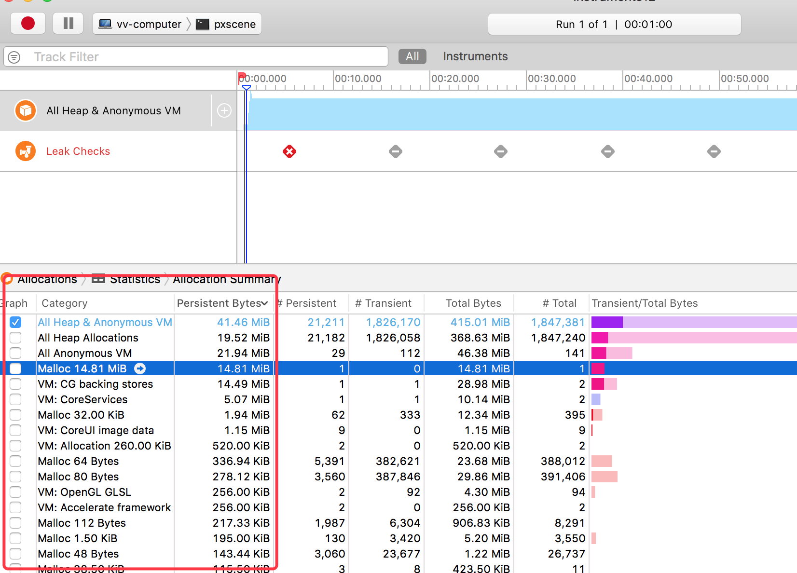
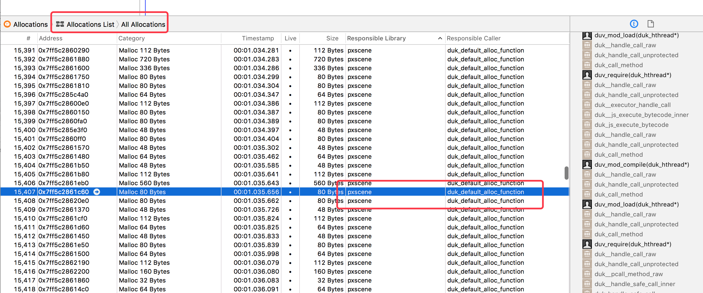
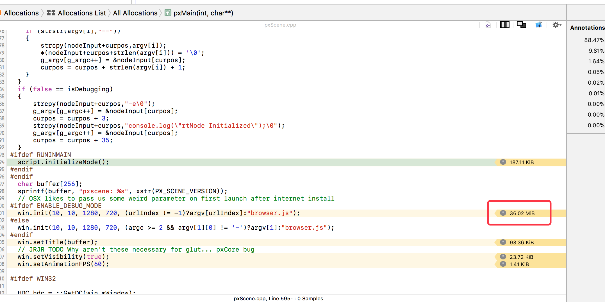
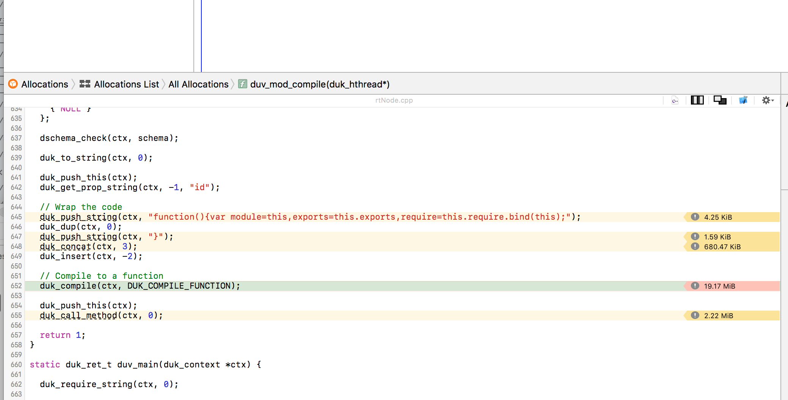
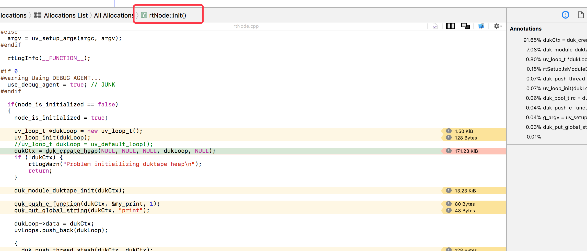

# pxscene memory usage on mac platform

## Document a good way to get memory usage statistics on the app when it's running and where the memory is going.

1. clone this project , follow build document to build all external libs for pxscene
2. and use xcode open *mac-build/pxscene2d.xcodeproj*
3. **build and run** , when run succeed, press *Command + 6*  to show summary memory usage , you will see on mac platform , the pxscene app need 39MB to run brower.js

3. click **profile in instruments** , to find more details about memory usage.

4. in statistics view, you can see the where are the memory, *Anonymous VM* memory are system controller, wo don't need dig it, let us find more details in *All Head Allocations*.

   

## Identify key areas of memory usage as they relate to our usage of duktape.

1. swtich to *Allocations list* to find *Responable library* is *pxscene*,   and you can see the call tree in right panel.

2. double click function name in right panel, you can see the function used memory 

   - main , all memory used in root function *pxMain*
   - duk js code compile , most of memory used for js code complie (duk runtime and duk loop)

   

   - rtNode

## summary

according above analysis,  the pxscene memory usage look like

- system need 50%
- duk runtime and loop , 45%
- js wrapper(rtNode) 2%